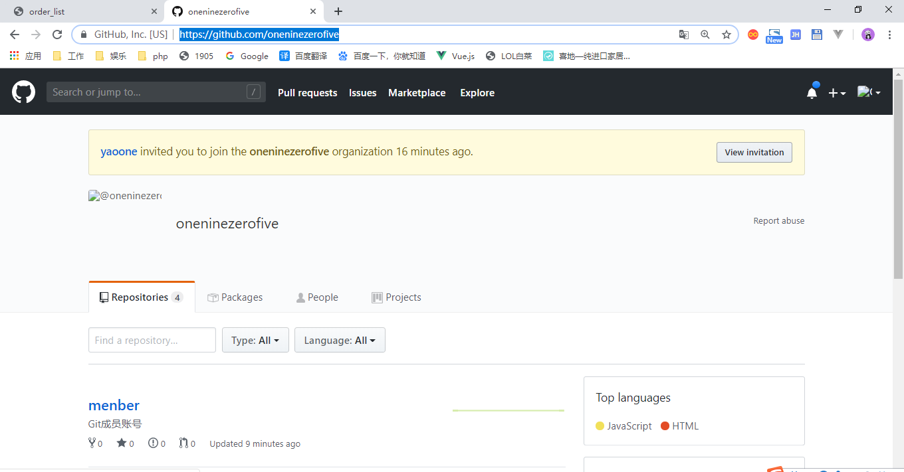
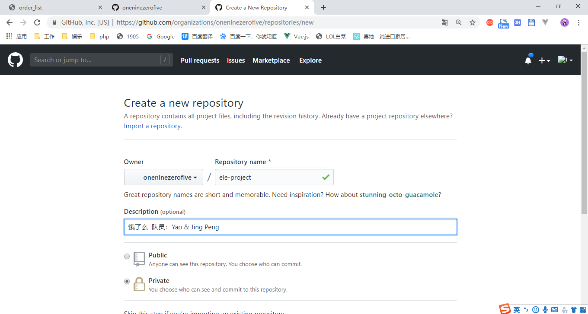
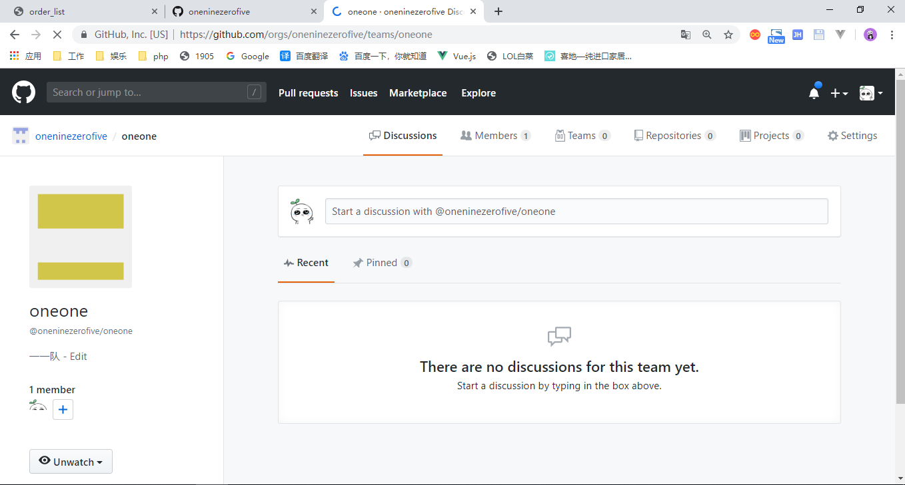
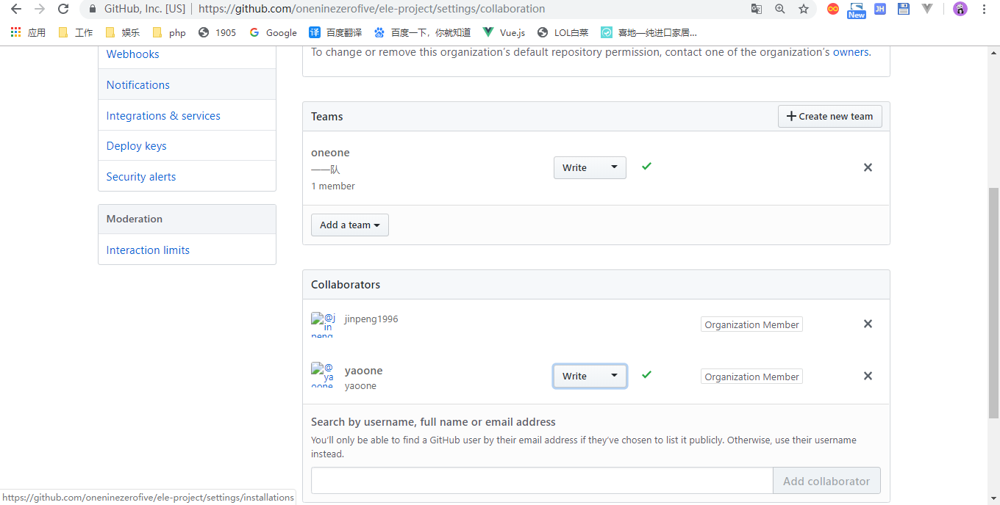
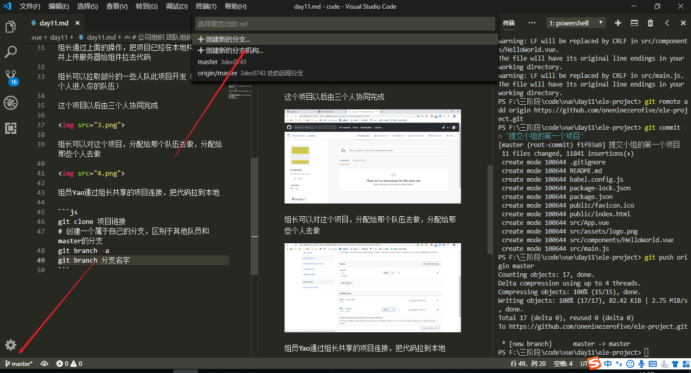

# 公司组织 团队组织

https://github.com/oneninezerofive



进去公司，你的团队老大可能会给你账号还有组织的连接，你确认邀请之后，在里面获取代码进行开发

组长在组织里面新建一个团队项目



- public 业余的开源项目
- private 公司项目

组长把本地项目初始化，新建好一个本地仓库
```
vue ui
vue create xxx
```

用命令行或者可视化工具，把项目上传Github的组织的项目里面

```
git init
git add .
git remote add origin 远程仓库连接
git commit -m '提交的内容'
```

组长通过上面的操作，把项目已经在本地构建完毕，并上传服务器给组件拉去代码

组长可以拉取部分的一些人队此项目开发（拉另外两个人进入你的队伍）

这个项目以后由三个人协同完成



组长可以对这个项目，分配给那个队伍去做，分配给那些个人去做



组员Yao通过组长共享的项目连接，把代码拉到本地

```js
git clone 项目链接
# 创建一个属于自己的分支，区别于其他队员和master的分支
git branch -a
git branch 分支名字
```



组长这边可以用这个命令获悉最新的分支信息

```bash
git fetch
# 获取远程的hello分支
git pull origin hello
# 组长在本地就可以看到组员的分支
git checkout hello
```

const plus = (num1+num2)=>{}
