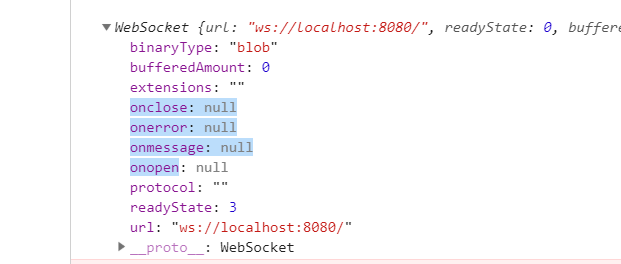
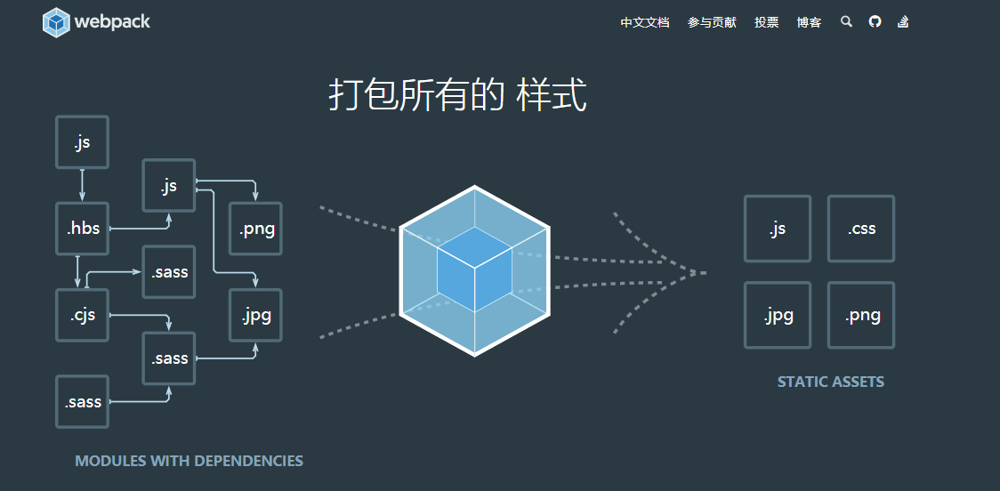
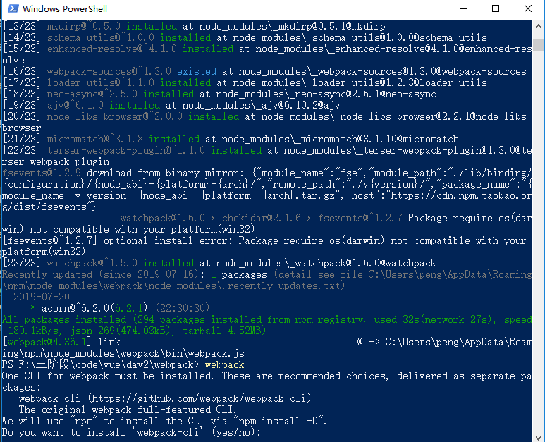
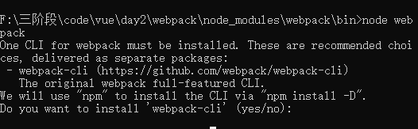
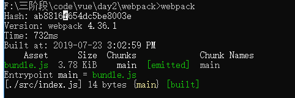

# websocket

# OSI七层 模型里面 


我们前端一般只会关注应用层

TCP/IP协议

三次握手，四次挥手

|层名|作用||
|-|-|-|
|应用层|网络服务与最终用户的一个接口。|HTTP FTP TFTP SMTP SNMP DNS TELNET HTTPS POP3 DHCP Websocket|
|表示层|数据的表示、安全、压缩。|JPEG、ASCll、DECOIC、加密格式等|
|会话层|建立、管理、终止会话。|对应主机进程，指本地主机与远程主机正在进行的会话|
|传输层|定义传输数据的协议端口号，以及流控和差错校验。|TCP UDP|
|网络层|进行逻辑地址寻址，实现不同网络之间的路径选择。|ICMP IGMP IP（IPV4 IPV6） ARP RARP|
|数据链路层|建立逻辑连接、进行硬件地址寻址、差错校验 [2]  等功能。（由底层网络定义协议）
将比特组合成字节进而组合成帧，用MAC地址访问介质，错误发现但不能纠正||
|物理层|建立、维护、断开物理连接。（由底层网络定义协议）|

TCP是短连接(ajax短http协议连接)，http的底层tcp，http 状态变化100->200

UDP是长久连接，websocket，连接建立了之后一般不会轻易终端 一直都在100

# 总结为

应用层：ajax请求 http协议(get,post)，请求头和请求体

传输层：TCP/UDP,TCP是http下一层，http或者https必定经过TCP，三次握手（建立稳定的连接，至少三次）

IP：找服务器的IP地址，去全球13台服务器里面把域名解析为IP地址

网路接口层：光纤


# 重温 HTTP 协议
HTTP 协议可以总结几个特点：
- 一次性的、无状态的短连接：客户端发起请求、服务端响应、结束。
- 被动性响应：只有当客户端请求时才被执行，给予响应，不能主动向客户端发起响应。
- 信息安全性：得在服务器添加 SSL 证书，访问时用 HTTPS。
- 跨域：服务器默认不支持跨域，可在服务端设置支持跨域的代码或对应的配置。

# 认识 TCP
TCP 协议可以总结几个特点：
- 有状态的长连接：客户端发起连接请求，服务端响应并建立连接，连接会一直保持直到一方主动断开。
- 主动性：建立起与客户端的连接后，服务端可主动向客户端发起调用。
- 信息安全性：同样可以使用 SSL 证书进行信息加密，访问时用 WSS 。
- 跨域：默认支持跨域。

# 认识 WebSocket
WebSocket 目前由 W3C 进行标准化。WebSocket 已经受到 Firefox 4、Chrome 4、Opera 10.70 以及Safari 5 等浏览器的支持。
如果在前端我们可以把 AJAX 请求当作一个 HTTP 协议的实现，那么，WebSocket 就是 UDP 协议的一种实现。

# node的ws原生模块

http原生模块，用于搭建http服务器，用express

客户端要发http是基于XMLHttpRequest,短连接

我们如果用node搭建ws协议的服务器，那么我们将会用到dgram模块
dgram 模块提供了 UDP 数据包 socket 的实现。用ws模块搭建。

客户端要发websocket是基于WebSocket，长连接


# 服务端 API

- 安装第三方模块 ws：`npm install ws`
- 开启一个 WebSocket 的服务器，端口为 8080
```javascript
var socketServer = require('ws').Server;
var wss = new socketServer({
	port: 8080
});
```
- 也可以利用 Express 来开启 WebSocket 的服务器
```javascript
var app = require('express')();
var server = require('http').Server(app);

var socketServer = require('ws').Server;
var wss = new socketServer({server: server, port: 8080});
```
- 用 on 来进行事件监听
- connection：连接监听，当客户端连接到服务端时触发该事件
- close：连接断开监听，当客户端断开与服务器的连接时触发
- message：消息接受监听，当客户端向服务端发送信息时触发该事件
- send: 向客户端推送信息

```javascript
wss.on('connection', function (client) {
    client.on('message', function (_message) {
    	var _messageObj = JSON.parse(_message);
        //status = 1 表示正常聊天
        _messageObj.status = 1;
    	this.message = _messageObj;
        //把客户端的消息广播给所有在线的用户
        wss.broadcast(_messageObj);
    });

    // 退出聊天  
    client.on('close', function() {  
        try{
            this.message = this.message || {};
            // status = 0 表示退出聊天
            this.message.status = 0;
            //把客户端的消息广播给所有在线的用户
            wss.broadcast(this.message);  
        }catch(e){  
            console.log('刷新页面了');  
        }  
    });  
});

//定义广播方法
wss.broadcast = function broadcast(_messageObj) {  
    wss.clients.forEach(function(client) { 
        client.send(JSON.stringify(_messageObj))
    });  
}; 
```
# 客户端 API

- 在支持 WebSocket 的浏览器下实例化 WebSocket ，参数为 WebSocket 服务器地址，建立与服务器的连接
```javascript
if(!WebSocket){
    $('.connState').text("您的浏览器不支持WebSocket");
    return false;
} 
//连接 socket 服务器
var socket = new WebSocket('ws://localhost:8080');
```


- onopen：当网络连接建立时触发该事件
```javascript
//监听 socket 的连接
socket.onopen = function(){
    $('.connState').text("服务已连接 ws://localhost:8080");
}
```
- onclose：当服务端关闭时触发该事件
```javascript
//监听服务端断开
socket.onclose = function(){
    $('.connState').text("服务已断开");
    socket = null;
}
```
- close: 在客户端断开与服务端的连接 `socket.close();`
- onerror：当网络发生错误时触发该事件
```javascript
//监听服务端异常
socket.onerror = function(){
    $('.connState').text("服务错误");
    socket = null;
}
```
- onmessage：当接收到服务器发来的消息的时触发的事件，也是通信中最重要的一个监听事件
```javascript
//监听服务端广播过来的消息
socket.onmessage = function(msg){
    var msgObj = JSON.parse(msg.data);
    if(msgObj.status == 0){
        $('<p>' + msgObj.nickname + '[' + msgObj.time + ']退出聊天</p>').appendTo('.msgList');
    } else{
        $('<p>' + msgObj.nickname + '[' + msgObj.time + ']：' + msgObj.message + '</p>').appendTo('.msgList');
    }
}
```
- send：向服务端推送消息
```javascript
var sendMessage = function(_mess){
    if(socket){
        var myDate = new Date();
        var now = myDate.getMonth() + '-' + myDate.getDate() + ' ' + myDate.getHours() + ':' + myDate.getMinutes() + ':' + myDate.getSeconds();				
        
        var mesObj = {
            nickname: $('#nickName').val(),
            message: _mess || $('#mesBox').val(),
            time: now
        }
        //向服务端发送消息
        socket.send(JSON.stringify(mesObj));
    }			
}
```

# 项目应用
该案例是一个多人聊天室

运行步骤
- npm install ws
- node socketServer

案例思路
- 服务端开户一个服务 `new socketServer({port: 8080});`
- 客户端建立和服务端的连接 `var socket = new WebSocket('ws://localhost:8080');`
- 建立连接的同时发送上线信息给服务端 `socket.send('加入聊天');`
- 服务端接受到客户端的消息触发 message 方法，然后将该消息广播给所有在线的用户
- 所有客户端收到来自服务端广播的消息，然后将该消息显示在聊天列表。
- 聊天和退出聊天都是重复着客户端发送消息，服务端接受消息然后向客户端广播消息，客户端显示广播消息。


# 什么是webpack

- [官方文档](https://www.webpackjs.com/)
- [npm文档](https://www.npmjs.com/package/webpack)

三阶段第一个重点，项目必要项

webpack 是一个模块打包器。webpack 的主要目标是将 JavaScript 文件打包在一起,打包后的文件用于在浏览器中使用

- 原生模块 http fs stream assert cypto path
- 第三方模块 jquery(jsdom) express mysql mongodb vue react request
- 自定义模块 db.js token.js

异步，面向对象，函数式编程，模块化(组件化)

因为工作我们开发的功能其实很复杂，那我们不可能用一份全部写完，也需要分工合作，也方便维护和开发，所以我们会利用很多模块来去拼凑一个项目

```js
webpack = gulp + requirejs
```




从上图看，左边的模块经过webpack变少了（多变少，类型，还有大小，数量都变少）

可以不直接写html,css,js，写其他预编译语言，jade,less,typescript，都可以通过webpack转化为浏览器识别代码，webpack可能会帮你预编译前端不能识别的语言，把它转化为浏览器能识别的语言

# 安装

webpack是一个第三方模块

写gulp的时候，新建一份`gulpfile.js`配置文件

同样道理webpack也需要一份配置文件，`webpack.config.js`，下面是webpack最基础的配置代码

从npm模块中心下载该模块，一定要安装，就像gulp全局安装一样，webpack全局安装完之后会诞生全局命令webpack
```bash
npm install webpack -g --save
```

```js
const path = require('path');
module.exports = {
  entry: './src/index.js',
  output: {
      path: path.resolve(__dirname, 'dist'),
    filename: 'bundle.js'
  }
};
```

如果安装成功的话，你将会看到以下



两种启动方式，全局安装命令里面输入webpack

局部安装./node_modules/webpack/bin/webpack

```
node webpack
```



如果你安装的是4.0版本以上的话，需要额外装

4.0之前是webpack webpack-cli在同一个包里面，4.0被完全分离开来，需要额外安装
```
npm install --save-dev webpack-cli 
```

# 入口 entry

入口文件，把这一份`./src/index.js`文件引入到webpack，经过webpack处理
```js
// 原生模块，处理路径
const path = require('path');
// 导出模块
module.exports = {
    // 模式 开发者和生产模式
    // mode: 'development',
    // 开发前用development，发布用production
    mode: 'production',
    // 入口
    entry: './src/index.js',
    // 出口
    output: {
        // 被绑好的bundle.js，定义输出的文件名为bundle.js
        filename: 'bundle.js',
        // 指定输出的路径
        path: path.resolve(__dirname, 'dist')
    }
};
```

# 出口 output

经过处理后的文件，从ouput的指定路径写下来

# 运行

把你的命令定位到webpack.config.js的目录下
```
webpack
```


# 模块化概念

跟node的模块概念是一样

```html
<script src="jquery"></script>
<script src="index"></script>
```
它一切的引入都受JS控制，并且跟node模块化概念是不谋而合的
```js
var $ = require('jquery');
var index = require('./index.js');
```
你可以新建一份index.html，把bundle.js引入，在浏览器里面执行
```html
<!DOCTYPE html>
<html lang="en">
<head>
    <meta charset="UTF-8">
    <meta name="viewport" content="width=device-width, initial-scale=1.0">
    <meta http-equiv="X-UA-Compatible" content="ie=edge">
    <title>Document</title>
</head>
<body>
    <script src="bundle.js"></script>
</body>
</html>
```

由于webpack是帮你把这个模块打包成JS，用于客户端的，node的原生模块一般不要打包进去

webpack一般是不支持原生模块的
```js
const $ = require('jquery')
const fs = require('fs')
console.log(fs)
console.log(1)
$('body').html('hello world')
```


# loader

loader 让 webpack 能够去处理那些非 JavaScript 文件（webpack 自身只理解 JavaScript）。loader 可以将所有类型的文件转换为 webpack 能够处理的有效模块，然后你就可以利用 webpack 的打包能力，对它们进行处理。

本质上，webpack loader 将所有类型的文件，转换为应用程序的依赖图（和最终的 bundle）可以直接引用的模块。


非JS模块

css，png，jpg，MP4，txt，html都叫非JS模块，都需要loader加载器处理

[官方加载器文档](https://www.webpackjs.com/loaders/)

# plugins

跟gulp的插件是很相似的

可以吧代码做重名压缩

压缩代码的插件
```js
npm i -D uglifyjs-webpack-plugin
```
一般只会压缩src里面的文件，node_modules的文件将不会被处理