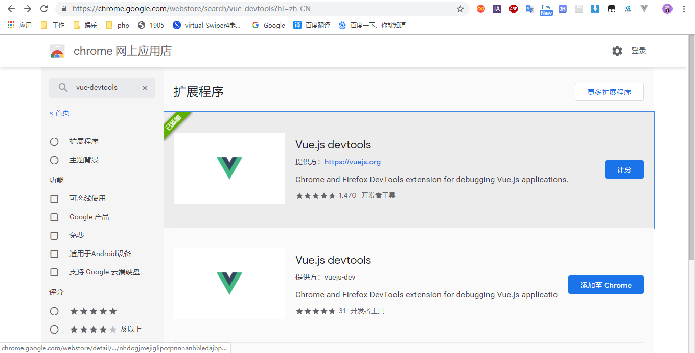
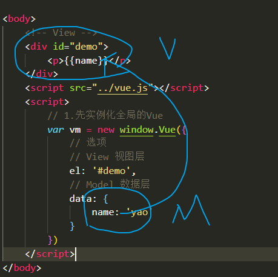
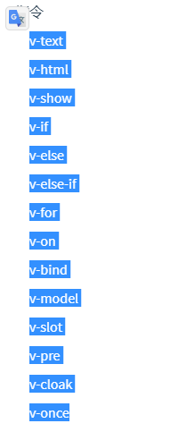
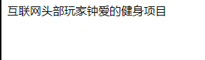

# 什么是Vue?

很重要的一个框架，是国产框架的佼佼者

前端三大框架中，唯一一个国产框架

目前世界上最流行的前端框架之一

vue,react,angular框架

小，轻量，简单

jquery是一个库

view类似读音 视图的意思，vue最终目的，所见即所得，用户看到的一切都用vue写

Vue 的核心库只关注视图层

# 安装

- 最简单的安装时从官网里面下载vue.js,用`<script></script>`标签引入到页面使用，也可以使用CDN引入

```html
<!-- 从本地引入 -->
<script src="vue.js"></script>
<!-- 从CDN服务器引入 -->
<script src="https://cdn.jsdelivr.net/npm/vue@2.6.10/dist/vue.js"></script>
```
- 配合npm和webpack
```
npm install vue --save
```
- vue-cli

# 调试工具

Vue Devtools用于调试vue的代码

你可以在访问谷歌商店的情况下，搜索vue-detools安装就可以了，如下图



不能访问

去github上面下载源代码

[vue-devtools源码地址](https://github.com/vuejs/vue-devtools.git)

在命令行里面输入一下代码，把vue-devtools源码从github克隆下来

```bash
git clone https://github.com/vuejs/vue-devtools.git
```

# hello world

jQuery,$全局拥有的

引入vue.js会在全局有一个Vue的全局变量

Vue是一个构造函数，拥有静态方法和原型方法
```js
function Vue(option){
    // 私有变量
    var a = 1
    // 公有变量
    this.name = option.name
    this.age = option.age
}
// 静态方法
Vue.extend = ()={

}
// 原型的方法
Vue.prototype.plus = ()=>{

}
var vm = new Vue({
    'yao',
    1
})
vm.name
```

```js
// 1.先实例化全局的Vue
var vm = new window.Vue({
    // 选项
})
console.log(vm)
```

# Model层

Vue在是实例化的时候需要在选项里面，初始化data数据，作为vue应用的数据，利用数据渲染到视图层上面
```js
// 1.先实例化全局的Vue
var vm = new window.Vue({
    // 选项
    // Model 数据层
    data: {
        name: 'yao',
        skill: [1, 2, 3],
        obj: {
            name: 'lin'
        },
        html: `<p>123</p>`,
        bool: true
    }
})
console.log(vm)
```

# View层

在选项里面可以添加一个el属性，element，元素节点，它需要放一个选择器，相当于
```js
document.querySelector() //相当于这个选择器
```
如果el是`#demo`是控制`<div id="demo"></div>`的视图范围，一般建议用id选择器
```html
<div id="demo">
    <p>{{name}}</p>
    <p>{{age}}</p>
</div>
<script src="../vue.js"></script>
<script>
    // 1.先实例化全局的Vue
    var vm = new window.Vue({
        // 选项
        // View 视图层
        el: '#demo',
        // Model 数据层
        data: {
            name: 'yao',
            age: 2
        }
    })
    console.log(vm)
</script>
```

# MV概念 MVVM

model->view

数据从data被vue绑定到视图层上面



# 模板语法

数据绑定最常见的形式就是使用“Mustache”语法 (双大括号) 的文本插值：

支持多元表达式

```html
<div id="demo">
<p>{{name}}</p>
<!-- 属性值操作 -->
<p>{{arr[0]}}</p>
<p>{{obj.skill}}</p>
<p>{{obj.skill}}</p>
<!-- 支持多元预算 -->
<!-- if else -->
<p>{{-age}}</p>
<p>{{name+age}}</p>
<p>{{age+8+'abc'}}</p>
<p>{{age>0?1:2}}</p>
</div>
<script src="../vue.js">
</script>
<script>
new Vue({
    el: "#demo",
    data: {
        name: 'yao',
        arr: ['a', 'b', 'c'],
        obj: {
            skill: 'ps,js,css'
        },
        age: 0
    }
})
</script>
```


# 指令


指令 (Directives) 是带有 `v-` 前缀的特殊特性。

- 内置指令(vue本身自带)
- 自定义指令(我们为vue写的，一般来说很少自己写)

下图这些就是vue的内置指令



指令放的地方是，标签放属性值的地方

<span v-text="msg" v-xxx v-xxx></span>

## v-text

模板语法`{{}}`跟`v-text`是一样的
```html
<!-- 渲染model的变量msg -->
<span v-text="msg"></span>
<!-- 渲染字符串name -->
<p v-text="'name'"></p>
<p 这家公司很坑别去了>{{name}}</p>
<!-- 和下面的一样 -->
<span>{{msg}}</span>
```

第一种写法写在属性值上面，不会影响页面的效果的，v-text不是html标签内置属性，v-xxx，建议用上面那种写法

$(V).text(M);

V<-(v-xxx)-M

你放入v-text的时候等价于选择了节点，然后把数据给渲染到这个地方

Vue只关注与视图，数据到位，视图就到位

## v-html

可以渲染html结构，相当于`$().html()`
```js
const vm = new Vue({
    // V
    el: '#demo',
    // M
    data: {
        name: 'yao',
        html: `<p>123<b style="color:red">456</b>789</p>`
    },
    // 模板
    template: `
        <div>
            <p>{{name}}</p>
            <p v-text="'name'"></p>
            <div v-html="html"></div>
        </div>
    `
})
```

# v-show

相当于`$().show()`，它接受一个布尔值，如果为真就显示，本质是改变display的属性'block':'none'

# v-if

和v-show在界面层的表现很相似，为真的那就增加，为假删除

`$().remove`和`$().append()`

搞清楚v-if和v-show，页面的状态频繁切换的话，v-show，如果状态只有一次变化的话用v-if

# v-else和v-else-if

只可以配合v-if使用的


# v-for

循环遍历`$().each()`

```html
<ul>
    <li v-for="item in arr" v-text="item.name"></li>
</ul>
```

支持v-for多层嵌套，并且可以结合其他的指令使用，比如你可以配合v-if实现筛选

```js
<ul>
    <li  v-for="item in arr" v-if="item.name==='jing'" >
        <p v-text="item.name"></p>
        <p v-for="s in item.skill" v-text="s"></p>
    </li>
</ul>
```
我们可以用(item,index)获取下标志，或者键对值
```html
<div v-for="(item, index) in items"></div>
<div v-for="(val, key) in object"></div>
<div v-for="(val, name, index) in object"></div>
```
加一个key有一个好处，等价于数据库，主键，防止出现重复渲染，让每一条都是对应唯一的一个key值
```html
<div v-for="item in items" :key="item.id">
  {{ item.text }}
</div>
```

# v-on

事件处理的指令，vue的事件绑定，处理事件都用这种方式去处理，`$().on()`，`addEventListener，xxx.onclick=()=>{}`

```html
<div onclick=""></div>
<div v-on:click=""></div>
<div v-on:xxxx=""></div>
```

要把需要监听的函数，放入methods选项里面
```js
new Vue({
    // 放函数
    methods: {}
})
```
如果不带参数，那里面可以获取event对象

下面两种写法是一样的

```js
@xxx === v-on:xxx
```

```html
<button @click="test">test</button>
<button v-on:click="test">test</button>
<button v-on:click="test(1)">test(带参数)</button>
<!-- 使用修饰符去防止冒泡或者阻止默认行为 -->
<button @click.stop.prevent="doThis"></button>
<button v-on="{ mousedown: doThis, mouseup: doThat }"></button>
<button @mousedown="doThis" @mouseup="doThat"></button>
```

M-C->V，数据变，视图跟着变，单向数据流，单向绑定

V-C->M

MVVM模式，双向数据绑定模式

MVC架构 Model View Control

MV

V

## v-bind

缩写
```
v-bind:xxx === :xxx
```
把标签的属性值转化为变量
```html


```

如果是class，style属性的时候可以支持数组或者对象

```html


```

## v-model

获取输入框的值
```
$().val()
```
可以用v-model把输入框的值获取到data的name里面，V->M->V，Vue里面除了事件以外可以V->M的唯一方法

V->M只能借助两个指令 v-on和v-model实现
```html
<input v-model="name" />
```

## v-pre

跳过这个元素和它的子元素的编译过程。
可以用来显示原始 Mustache 标签。
跳过大量没有指令的节点会加快编译。

vue编译时会跳过这个元素和它的子元素的编译过程
```js
<span v-pre>{{ this will not be compiled }}</span>
```

即使data里面定义了msg这里仍然是显示的{{msg}}
```js
<span v-pre>{{msg}}</span>  
```

## v-cloak

- 用法：

这个指令保持在元素上直到关联实例结束编译。和 CSS 规则如 [v-cloak] { display: none } 一起用时，这个指令可以隐藏未编译的 Mustache 标签直到实例准备完毕。

- 使用之前
```html
<div id="app">
    {{context}}
</div>
```

```js
<script>
    var app = new Vue({
        el: '#app',
        data: {
            context:'互联网头部玩家钟爱的健身项目'
        }
    });
</script>
```
效果：


- 使用之后
```css
[v-cloak]{
    display: none;
}
```

```html
<div id="app"  v-cloak>
    {{context}}
</div>
```

```js
<script>
    var app = new Vue({
        el: '#app',
        data: {
            context:'互联网头部玩家钟爱的健身项目'
        }
    });
</script>
```
效果：


在简单项目中，使用 v-cloak 指令是解决屏幕闪动的好方法。但在大型、工程化的项目中（webpack、vue-router）只有一个空的 div 元素，元素中的内容是通过路由挂载来实现的，这时我们就不需要用到 v-cloak 指令咯。


## v-once

- 详细

只渲染元素和组件**一次**。随后的重新渲染，元素/组件及其所有的子节点将被视为静态内容并跳过。这可以用于优化更新性能。

```html
<!-- 单个元素 -->
<span v-once>This will never change: {{msg}}</span>
<!-- 有子元素 -->
<div v-once>
  <h1>comment</h1>
  <p>{{msg}}</p>
</div>
<!-- 组件 -->
<my-component v-once :comment="msg"></my-component>
<!-- `v-for` 指令-->
<ul>
  <li v-for="i in list" v-once>{{i}}</li>
</ul>
```