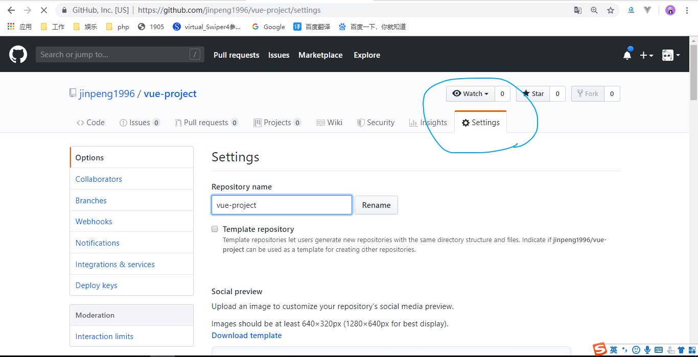
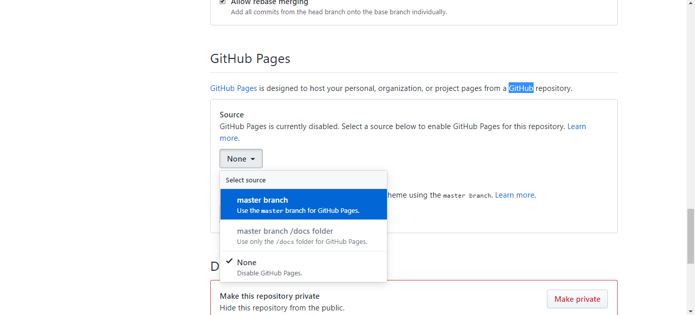
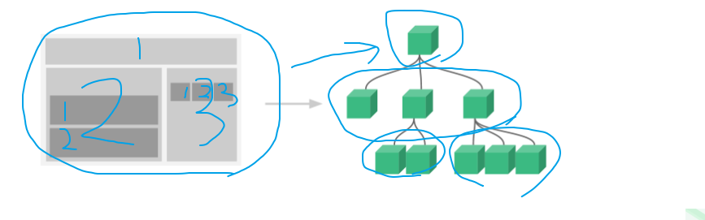

# git上传

工作中的代码提交，物理U盘，git服务器整个公司的代码

每天需要把代码上传git上面，方便维护和团队开发

vue-webpack本地开发的项目

国内很多公司gitee码云，gitlab，当年github在国内支持不够友好，并且私有仓库收费

上传代码完成后

打开git仓库的setting面板





生成一体网址，然后发给我预览

https://jinpeng1996.github.io/vue-project/dist/

# 计算属性

有时候我们数据模型里面有些值不一定是我们用到的那个状态，比如有时候我们需要把时间戳转人类识别时间格式，把数字经过汇率转化为货币的价格

```html
<div id="demo">
    <p>{{nameEn}}</p>
</div>
<script src="../vue.js"></script>
<script>
    var vm = new Vue({
        el: '#demo',
        // M
        data: {
            name: 'yao'
        },
        // 选项
        computed: {
            // 你要计算的结果
            nameEn() {
                let nameEn = this.name + ' eno'
                return nameEn
            }
            // 不能再用name，因为data已经定义了
            // name() {}
        }
    })
</script>
```

如上面的代码nameEn就是被计算出来的结果，它通过一个函数去计算，用name计算出来的，data有name结果，computed是不能在有name这个结果，如果computed里面的这个结果不用于View层，那么函数将不会被触发。

# 监听器

利用watch这个属性值来监听data的属性值变化

```html
<div id="demo">
    <p>{{num}}</p>
</div>
<script src="../vue.js"></script>
<script>
    var vm = new Vue({
        el: "#demo",
        data: {
            num: 1
        },
        // 上面data有的值才可以监听
        watch: {
            // 监听num的变化
            num() {
                // 每次num改变，该函数就会触发
                console.log(this.num)
            }
        }
    })
    setInterval(() => {
        vm.num += 1
    }, 1000)
</script>
```

# 组件

零件`Vue.component`是通过Vue的静态方法实现的，`new Vue({})`最大组件，它是所有组件的容器

真正的组件化，是html和css和js的高度封装
```js
// 定义一个名为 button-counter 的新组件
Vue.component('button-counter', {
  data: function () {
    return {
      count: 0
    }
  },
  template: '<button v-on:click="count++">You clicked me {{ count }} times.</button>'
})
```
css无法局部化，id具有唯一性，组件复用性，无法复用的
```html
<!-- html View -->
<div id="header"></div>
<div id="navigation"></div>
<div id="main"></div>

<!-- js Model -->
<script src="../vue.js"></script>
<script src="container/header.js"></script>
<script src="container/navigation.js"></script>
<script src="container/main.js"></script>
```

Vue提供了一个方法帮你改写上面的思路，同样是组件化，要做得更极致

组件的名字不要用数字用符号，先定义组件，再容器把组件展示出来

```js
// 组件 拥有名字 一般有多个
Vue.component('组件名字',{
    // 选项
})
// 容器 没有名字 一般只有一个
new Vue({

})
```

一个项目应该只有一个根容器，有多个组件在容器里面拼接
```html
<style>
    * {
        margin: 0;
        padding: 0;
    }

    header {
        width: 100%;
        height: 50px;
        line-height: 50px;
        text-align: center;
        color: white;
        background-color: red;
    }
</style>
<div id="demo">
    <!-- 组件其实也是自定义标签 -->
    <my-header></my-header>
    <my-header></my-header>
    <my-header></my-header>
</div>
<script src="../vue.js"></script>
<script>
    Vue.component('my-header', {
        template: `
            <header>头部组件</header>
        `
    })
    // 根容器
    new Vue({
        el: "#demo"
    })
</script>
```

组件其实就是自定义标签，然后用这个自定义标签放到容器上显示

标签的语义化

# 封闭性 el和data的区别

组件的数据是独立存在的，相互不受干扰，组件也不需要el选项，因为它需要使用只认名字

data在组件里面必须是函数
```js
data() {
    return {
        name: 'yao'
    }
}
```

组件实例化一次都返回一个全新的数据，它其实是类似深拷贝

```js
Vue.component('my-footer', {
    // 每个组件在经过使用的时候都返回一个全新的data数据模型
    // M
    data() {
        return {
            name: 'yao'
        }
    },
    // V
    template: `
        <div>
            底部组件
            <input v-model="name" />
        </div>
    `
})
```

组件允许并列，嵌套，组件不但可以拥有兄弟关系，还可以拥有父子关系


# JSX

第一页，用户看到的那一页
template
```html
<div :name="name">{{name}}</div>
```

第二页，模板，虚拟DOM
render
```js
render(createElement) {
    return createElement('div', {
        attrs: {
            name: this.name
        }
    }, this.name)
},
template:`
    <div :name="name">{{name}}</div>
`
```
用对象去描述真实的DOM结构
```js
{
    tag: "div",
    data: attrs: {name: "yao"},
    children: [{
        tag: undefined
        text: "yao",
        children: undefined
    }]
}
```

空间换时间

```html
<template name="component-name">
    <div>
        hello world
        <p>123</p>
        <ul>
            <li>1</li>
        </ul>
        <p>123</p>
    </div>
</template>
```
用函数来描述整个html结构
```js
vdom = obj = h(
    "div",
    null,
    "hello world",
    h("p", null, "123"),
    h("ul", null, h("li", null, this.name)),
    h("p", null, "123")
);
```

```js
{
    tag: "div",
    data: attrs: {name: "yao"},
    children: [{
        tag: undefined
        text: "yao",
        children: undefined
    }]
}
{
    tag: "div",
    data: attrs: {name: "jing"},
    children: [{
        tag: undefined
        text: "yao",
        children: undefined
    }]
}
```
对象和对象想比较

vue.js完整就是既支持template写法，也支持render的写法

vue.runtime.common.dev.js，只支持render的写法，你必须在开发的时候用template写，但是需要后端node和webpack帮你把template转化为render


## 组件的全局注册和局部注册

可以做组件的局部注册，组件内部可以放一个components选项，来注册组件的，局部组件，注册了谁才可以用谁



```js
new Vue({
    components: {
        'my-footer': myFooter,
        'my-header': {
            components: {
                'my-footer': myFooter,
            },
            template: `
                <header>
                    头部组件
                    <my-footer></my-footer>
                </header>
            `
        }
    }
})
```

## 通过 Prop 向子组件传递数据

property属性

通过标签的属性，让父组件传递数据给子组件

类似继承的特性，子组件可以从父组件获取继承值

如果你作为父组件，你下面有很多子组件的话，那么你可以props给它传递值，父亲可以把自己的遗产传承给他，也等价于可以发命令，儿子

```js
Vue.component('my-header', {
    // 从标签的属性值上面获取父组件给我的值
    props: ['abc'],
    template: `
        <header>
            头部组件{{this.abc}}
        </header>
    `
})

// 根容器
new Vue({
    el: "#demo",
    data: {
        num: 1000
    },
    template: `
        <div>
            <my-header :abc="num"></my-header>
            <my-header :abc="num"></my-header>
            <my-header abc="999"></my-header>
        </div>
    `
})
```
可以传不同的props来改变组件的状态，使同一个组件拥有不一样的状态，而决定权在父组件手上


```html
<my-header color="red" :title="title" :abc="num"></my-header>
<my-header color="blue" title="支付宝" :abc="num"></my-header>
<my-header color="yellow" title="百度" abc="999"></my-header>
```

## 自定义事件

this.$emit和this.$on自定义事件方法，不属于原生的事件，是自己定义的事件

```js
var vm = new Vue();
vm.$emit('toHeader', this.name);
vm.$on('toHeader', (data) => {
    console.log(data)
    this.name = data
});
```

## 插槽

`<slot></slot>`的内置组件，可以把外部的标签内容带到这个地方显示，可以用props来解决类似问题的，slot插槽只支持带html结构进去组件内部

```js
Vue.component('my-header', {
    template: `
        <header>
            头部组件 {{this.name}}
            <slot></slot>
        </header>
    `
})

// 根容器
new Vue({
    el: "#demo",
    template: `
        <div>
            <!-- 组件其实也是自定义标签 -->
            <my-header>
                <p>123</p>
            </my-header>
            <my-header></my-header>
            <my-header></my-header>
        </div>
    `
})
```