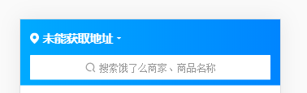
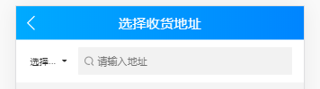

# 预习

单文件组件

# 封装一个组件

定义一个组件，让它拥有两个状态，配合webpack

- props
- slots




# 计算属性和侦听器

watch computed

```html
<!DOCTYPE html>
<html lang="en">

<head>
    <meta charset="UTF-8">
    <meta name="viewport" content="width=device-width, initial-scale=1.0">
    <meta http-equiv="X-UA-Compatible" content="ie=edge">
    <title>Document</title>
</head>

<body>
    <input />
    <p>你好123456你好123456</p>
</body>

</html>
```

```js
new Vue({
    data:{
        html: `<p>你好123456你好123456</p>`
    },
    computed:{
        computedHtml(){
            var html = this.html
            <p><b>你好</b>123456<b>你好</b>123456</p>
            return html
        }
    }
})
```