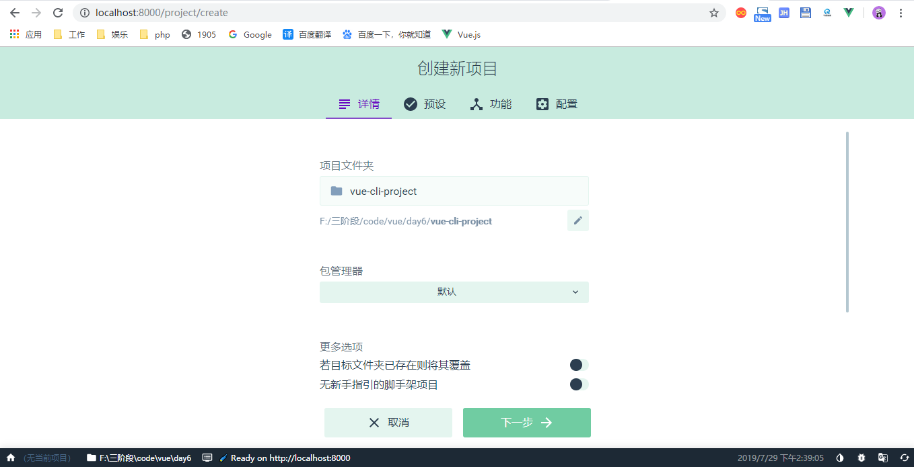
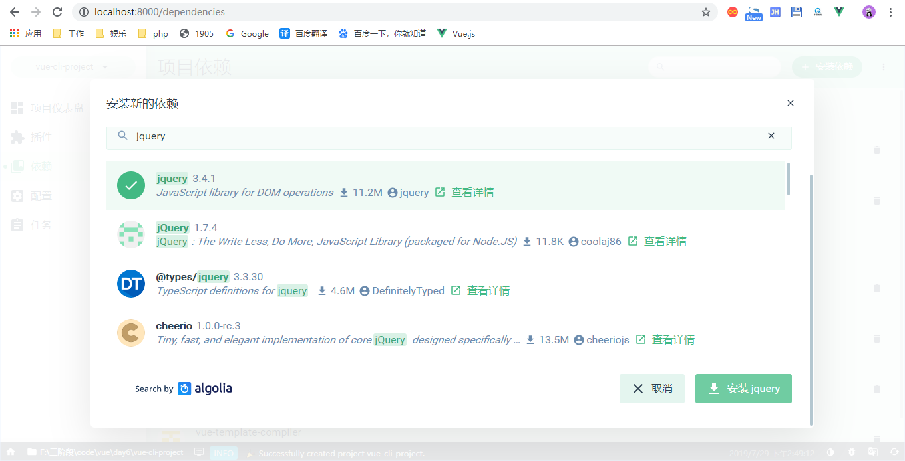

# 项目化

- 单文件组件
- vue-cli脚手架(webpack上层建筑)

# 样式我们用ui

我们只写逻辑，跟vue

样式给忽略掉

ui，除了网上截取的样式，用大厂的weui，ant-design，element-ui


# 单文件组件

在很多 Vue 项目中，我们使用 Vue.component 来定义全局组件，紧接着用 new Vue({ el: '#container '}) 在每个页面内指定一个容器元素。

这种方式在很多中小规模的项目中运作的很好，在这些项目里 JavaScript 只被用来加强特定的视图。但当在更复杂的项目中，或者你的前端完全由 JavaScript 驱动的时候，下面这些缺点将变得非常明显
```js
Vue.extend()
Vue.component({
    template: `
        <div>hello world</div>
    `
})
```
所以单文件组件是解决大型复杂项目的一个方案

文件扩展名为 `.vue` 的 single-file components(单文件组件) 为以上所有问题提供了解决方法

.vue本质就是把html,js,css写在一份叫.vue的文件里面

从这个单文件组件开始组装一个用用，vue文件帮你封装每个组件的所有内容

过去我们要这样定义一个组件
```js
const Vue = require('vue');
Vue.component('xheader', {
    template: `
        <header>头部组件</header>
    `
})
const vm = new Vue({
    // V
    el: '#demo',
    template: `
        <xheader></xheader>
    `
})
console.log(vm)
```
那现在我们就做改变了,要用一份.vue的后缀文件去重写上面的组件

可以在里面用`scoped`属性值实现局部样式
```html
<style scoped>
</style>
```
由于你改写了上面的那份文件，是非JS后缀的Vue文件，所以需要一个加载器在webpack做处理，那个加载器就是vue-loader

# Vue Loader 是什么？

Vue Loader 是一个 webpack 的 loader，它允许你以一种名为单文件组件 (SFCs)的格式撰写 Vue 组件：

安装两个模块，一个是加载器，一个用于处理template

```bash
npm install -D vue-loader vue-template-compiler
```
在webpack.config.js的加载器配置里面加入vue-loader的配置，记得引入插件
```js
// webpack.config.js
const VueLoaderPlugin = require('vue-loader/lib/plugin')

module.exports = {
  module: {
    rules: [
      // ... 其它规则
      {
        test: /\.vue$/,
        loader: 'vue-loader'
      }
    ]
  },
  plugins: [
    // 请确保引入这个插件！
    new VueLoaderPlugin()
  ]
}
```
ES5的模块化写法，Vue都是默认支持ES6
```js
// 以模块的方式引入vue
const Vue = require('vue/dist/vue');
// const Vue = require('vue');
// import Vue from 'vue'
// Vue.component('xheader', {
//     template: `
//         <header>头部组件</header>
//     `
// })
// 等价Vue.extend()
const xheader = require('./components/xheader.vue')
// 全局注册
// Vue.component('xheader', xheader)
console.log(xheader)
const vm = new Vue({
    // V
    el: '#demo',
    // render(creatElement) {
    //     return creatElement("xheader")
    // },
    components: {
        // 注册
        xheader: xheader.default
    },
    template: `
        <xheader></xheader>
    `,
    // template,
    // render
})
console.log(vm)
```

# Common.js规范和ES6规范

## 引入
Common.js，是node规范
```js
const xheader = require('./components/xheader.vue')
```
es6规范
```js
import xheader from './components/xheader.vue'
```

## 导出

Common.js，是node规范
```js
module.exports = {
  // 选项
  data() {
    return {
      title: "头部组件"
    };
  }
};
```
es6规范
```js
export default {
  // 选项
  data() {
    return {
      title: "头部组件"
    };
  }
};
```

# 组件化在webpack的尝试

- dist 出口 发布
- src 入口 开发
  - components 单文件组件 xxx.vue
  - app.vue 所有组件的父组件
  - index.css 全局样式
  - index.js 整个项目入口逻辑
  - package.json
  - webpack.config.js

只有一个`<template>`，有没有其他`<style><script>`这些都没关系，后面这些都可以有多个
```html
<template>
  <header v-text="title"></header>
</template>
```
必须局部注册
```js
import xheader from "./components/xheader.vue";
import xsearch from "./components/xsearch.vue";
export default {
  components: {
    xheader,
    xsearch
  }
};
```
全局注册
```js
import Vue from 'Vue'
import xheader from "./components/xheader.vue";
import xsearch from "./components/xsearch.vue";
Vue.components('xheader',xheader);
```

# Vue CLI

Command Line Interface命令界面

Vue脚手架工具，集大成者的环境，webpack，vue-loader全部给你配置好

- [Vue CLI](https://cli.vuejs.org/zh/)

安装脚手架环境，全局安装会诞生一个vue的命令
```bash
npm install -g @vue/cli
cnpm install -g @vue/cli
# OR
yarn global add @vue/cli
```

创建一个项目： UI界面，非常适合新手
```bash
vue create my-project
# OR
vue ui
```

执行`vue ui`，它会自动在浏览器里面自动打开一个界面，你可以在这里创建你的Vue项目



- ESLint 代码风格检测
- babel 支持ES6

插件：vue-router，vuex，利用`vue.use()`第三方开发者帮你写好的vue补丁，就是额外vue没有的功能

依赖：以前你都需要在npm上安装依赖，那现在使用可视化界面帮你安装

```bash
npm install xxx
```
等价于在你的项目package.json目录下，用命令安装
```json
// 运行依赖
"dependencies": {
  "core-js": "^2.6.5",
  "vue": "^2.6.10",
  "weui": "^2.0.1"
},
// 开发依赖
"devDependencies": {
  "@vue/cli-plugin-babel": "^3.9.0",
  "@vue/cli-plugin-eslint": "^3.9.0",
  "@vue/cli-service": "^3.9.0",
  "babel-eslint": "^10.0.1",
  "eslint": "^5.16.0",
  "eslint-plugin-vue": "^5.0.0",
  "vue-template-compiler": "^2.6.10"
},
```


```js
Vue.component('xxx',{
  template,
  render()
})
```

## 代码目录

前端自动构建化，webpack实现自动化，模块化，组件化

- dist 出口文件夹 发布的文件夹，丢给后端，让它发布到服务器
- public 就是你要发布的公有资源，比如你的首页，将会根据里面index.html生成
- src 入口文件夹
  - assets 静态文件夹 存放图片 样式 音频 视频
  - components xxx.vue存放单文件组件
  - App.vue 所有的组件父组件
  - main.js 入口文件


