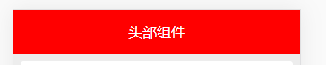
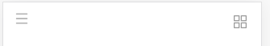
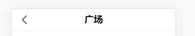
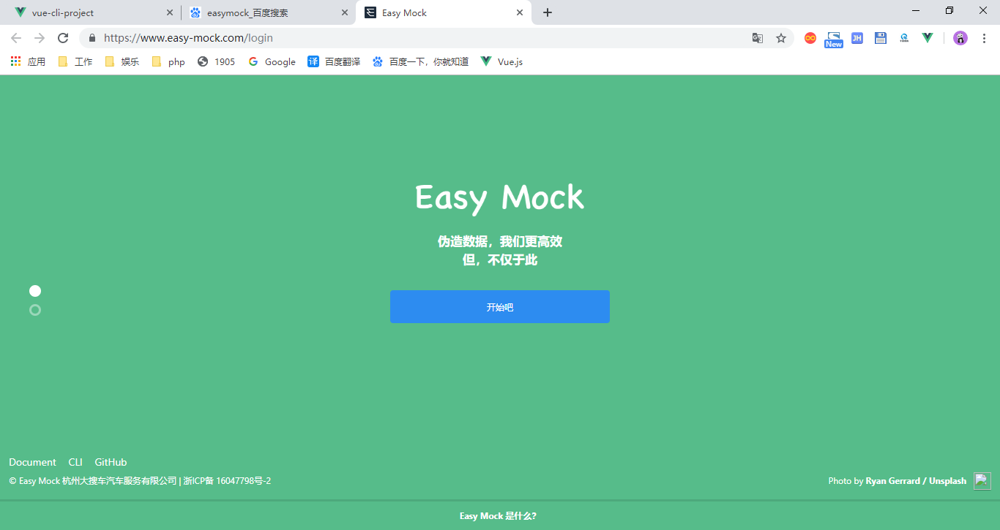
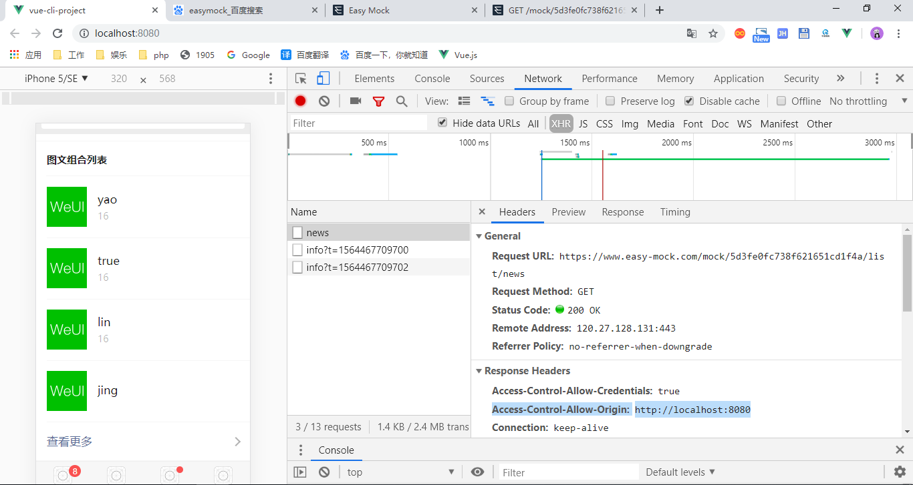

# UI


weui堆组件

# 设计一个复用的头部





一个头部会有多个状态，就是在不用页面使用的时候，会不用的功能

```js
<header>
    <div class="leftIcon">
        
    </div>
    <div class="title" v-text="title"></div>
    <div class="rightIcon">
        
    </div>
</header>
```
利用插槽和props实现同一个组件不同的状态
```html
<Header color="blue" status="2">
    <div>百度</div>
</Header>
<Header title="支付宝" color="red" status="1">
    <div>支付宝</div>
</Header>
<Header title="腾讯" color="green" status="0">
    <div>腾讯应用宝</div>
</Header>
```

# 组件是支持用sass

支持预编译，需要在脚手架里面安装`sass-loader`，
```bash
npm install sass-loader node-sass
```
```html
<style lang="scss">
header {
  text-align: center;
  line-height: 50px;
  width: 100%;
  height: 50px;
  color: white;
  background-color: red;
  display: flex;
}
</style>
```

# Easy Mock

使用Easy Mock来模拟一些数据，本质就是等价于把数据写死一份JSON文件里面，你再ajax请求JSON文件





# vant ui

有时候我们开发的时候可以去使用别人写好的组件

```bash
# 通过 npm 安装
npm i vant -S
```

## 引入组件

方式一. 自动按需引入组件 (推荐)

babel-plugin-import 是一款 babel 插件，它会在编译过程中将 import 的写法自动转换为按需引入的方式


```js
# 安装插件
npm i babel-plugin-import -D
```

```js
// 对于使用 babel7 的用户，可以在 babel.config.js 中配置
module.exports = {
  plugins: [
    ['import', {
      libraryName: 'vant',
      libraryDirectory: 'es',
      style: true
    }, 'vant']
  ]
};
```
在你的main.js把你想要用的组件引入项目里面

```js
import Vue from 'vue'
// 自定义组件
import App from './App.vue'
// 第三方组件
import {
  Search
} from 'vant';
Vue.use(Search);

Vue.config.productionTip = false

new Vue({
  render: h => h(App),
}).$mount('#app')
```

# element ui

后台管理系统，倾向于PC端UI