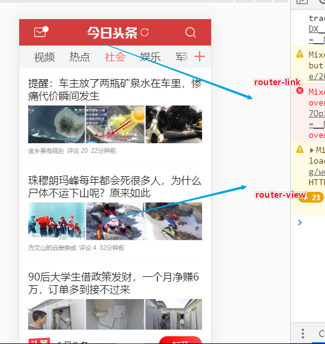
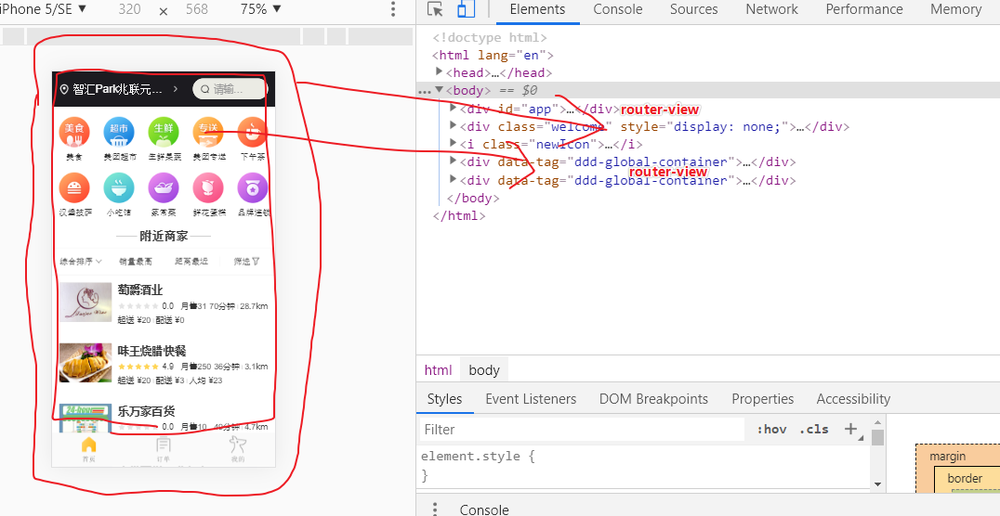

# 路由

从一个页面跳转到另外一个页面


## 多页面应用程序

home.html列表页

detail.html详情页

如果你所在是home.html列表页，你可以使用一个a标签做跳转
```html
<a href="./detail.html">
```
JS跳转
```js
window.href = 'xxx'
```

## 单页面应用程序

只有一个页面的，相比多页应用程序，它只需要局部更新，有时候也可以全局更新，路由类似一个特殊的选项卡，在页面跳转的时候能提供更好的用户体验，局部更新

# vue-router

- [官方文档](https://router.vuejs.org/)

vue-router实现单页面应用(SPA)

single page application

## NPM安装

```bash
npm install vue-router
```
如果在一个模块化工程中使用它，必须要通过 `Vue.use()` 明确地安装路由功能：
```bash
import Vue from 'vue'
import VueRouter from 'vue-router'

Vue.use(VueRouter)
```

## 路由内置组件

`<router-link>`相当于a标签
```html
<!-- 使用 router-link 组件来导航. -->
<!-- 通过传入 `to` 属性指定链接. -->
<!-- <router-link> 默认会被渲染成一个 `<a>` 标签 -->
<router-link to="/foo">Go to Foo</router-link>
<router-link to="/bar">Go to Bar</router-link>
```
我们实现局部更新，所以这个`<router-view>`就是页面要展示的视图，它会对应的组件
```html
<!-- 路由出口 -->
<!-- 路由匹配到的组件将渲染在这里 -->
<router-view></router-view>
```


## 配置路由

> 1. 定义 (路由) 组件。
在我们项目里面我们会引入`xxx.vue`组件，而不是用下面这种简单的组件写法
```js
// 1. 定义 (路由) 组件。
// 可以从其他文件 import 进来
const Foo = { template: '<div>foo</div>' }
const Bar = { template: '<div>bar</div>' }
```

> 2. 定义路由

如果匹配到/foo时候，加载Foo组件，而如果匹配到/bar，加载Bar，类似express的路由

前端路由和后端路由很相似，后端路由是匹配路径，然后做后端逻辑(文件上传，数据处理，数据库操作)

前端路由，同样也是匹配路径，只是路径变化，而是视图跟着变化
```js
// 2. 定义路由
// 每个路由应该映射一个组件。 其中"component" 可以是
// 通过 Vue.extend() 创建的组件构造器，
// 或者，只是一个组件配置对象。
// 我们晚点再讨论嵌套路由。
const routes = [
  { path: '/foo', component: Foo },
  { path: '/bar', component: Bar },
  { path: '/home', component: Home }
]
```

> 3. 创建 router 实例，然后传 `routes` 配置

```js
// 3. 创建 router 实例，然后传 `routes` 配置
// 你还可以传别的配置参数, 不过先这么简单着吧。
const router = new VueRouter({
  routes // (缩写) 相当于 routes: routes
})
```
> 4. 创建和挂载根实例。

```js
// 4. 创建和挂载根实例。
// 记得要通过 router 配置参数注入路由，
// 从而让整个应用都有路由功能
const app = new Vue({
  router
}).$mount('#app')
````

## 动态路由匹配

这个`?id=1`，根据上一个页面(路由)，传递进来会产生变化，所以需要在定义路由规则的时候加上：符号
```js
http://localhost:8080/#/detail?id=1
http://localhost:8080/#/detail/1
```
`:id`可变的

以下路径都可以匹配进入detail组件
```
http://localhost:8080/#/detail/1
http://localhost:8080/#/detail/2
http://localhost:8080/#/detail/3
http://localhost:8080/#/detail/xxxkkkk
```
下面这种进不去
```
http://localhost:8080/#/detail/##
http://localhost:8080/#/detail///
http://localhost:8080/#/detail/??%%&&
http://localhost:8080/#/detail/xxxkkkk/kkk
```
```js
const routes = [
  { path: '/foo', component: Foo },
  { path: '/bar', component: Bar },
  { path: '/detail/:id', component: Detail }
]
```

路由离场进场，会触发组件的创建和销毁的生命周期，v-if和router-view

如果你要获取动态路由上面的参数，你可以在该路由的组件data里面获取，它会自动生成一个$route挂载组件的M层上面
```js
this.$route.xxx
```

动态路由传参其实是一个特殊的Get请求传参，也是组件通信的一种特殊方式

# 嵌套路由

一个主舞台，`<router-view>`嵌套`<router-view>`

```html
<router-view></router-view>
```
在配置项里面写多一个children，里面存放的数组，跟routes数组是相似的，而里面的path注意是没有/


```bash
# 如果你现在要进入Home组件的话
http://localhost:8000/#/tabbar/home
# 如果你现在要进入Order组件的话
http://localhost:8000/#/tabbar/order
```
tabbar所在的主舞台是第一层router-view，tabbar在进场的时候router-view，提供给home组件展示
```js
const routes = [{
        path: '/tabbar',
        component: Tabbar,
        // 嵌套路由，先进底部选项卡，再去找首页
        children: [{
            // 第二层路由的path是没有/
            path: 'home',
            component: Home,
        }, {
            path: 'order',
            component: Order,
        }, {
            path: 'mine',
            component: Mine,
        }]
    },
    {
        path: '/detail/:id/:name',
        component: Detail
    }
]
```

# 编程式的导航

如果你所在是home.html列表页，你可以使用一个a标签做跳转
```html
<a href="./detail.html">
```
JS跳转
```js
window.href = 'xxx
window.history = 'xxx'
```
如果你利用JS的方法实现跳转，那就称之为**编程式导航**，本质上都是对`window.history`方法的封装

|声明式|编程式|
|-|-|
|`<router-link :to="...">`|`$router.push(...)`|
|HTML|JS|

通过`this.$router.xxx`的方法实现跳转，来代替`<router-link :to="...">`
```js
methods: {
  onSearch() {},
  // 编程式导航
  navTo(id) {
    this.$router.push({
      name: "detail",
      params: { id, name: "lin" }
    });
  }
}
```

# 重定向和别名

重定向也是通过 routes 配置来完成，下面例子是从 `/a` 重定向到 `/b`：

如果你重新加载你的页面的时候，它默认帮你跳转的那个路由

如果路由匹配到/，自动跳转到/tabbar/home
```js
// 重定向
{
    path: '/',
    redirect: '/tabbar/home'
}
```
支持你放对象

```js
{
  path: '/',
  redirect: {
      name: 'detail',
      params: {
          id: 1,
          name: 'yao'
      }
  }
}
```
我们可以让 / 路由拥有第二个名字 /index.html

```js
// 重定向
{
    path: '/',
    // 别名
    alias: '/index.html',
    redirect: () => {
        // 我要跳进/123获取路由的一些详情信息
        // console.log(to)
        // 方法接收 目标路由 作为参数
        // return 重定向的 字符串路径/路径对象
        return '/tabbar/home'
    }
}
```
```bash
# 下面三者等价
http://localhost:8080/#/index.html
http://localhost:8080/#/
http://localhost:8080/#/tabbar/home
```


# HTML5 History 模式

vue-router 默认 hash 模式 —— 使用 URL 的 hash 来模拟一个完整的 URL，于是当 URL 改变时，页面不会重新加载。

hash模式有个特征，就是url有个非常丑的 # 号
```bash
http://localhost:8080/#/index.html
```
```js
const router = new VueRouter({
  mode: 'history',
  routes: [...]
})
```

history比hash模式好看

必须后端支持，没后端，没服务器你就不能这种模式

如果你把#去掉，要考虑，兼容性，还有是否跟后端路由冲突

# 导航守卫

进入路由之前，会有个门卫作为保护

```js
const router = new VueRouter({
    // 你默认是哈希模式，改为H5 history模式
    mode: 'history',
    routes // (缩写) 相当于 routes: routes
})

// 全局前置守卫

// 要进入路由，都要先通过这个守卫

router.beforeEach((to, from, next) => {
    // ...
})
```

- to: Route: 即将要进入的目标 路由对象
- from: Route: 当前导航正要离开的路由
- next: Function: 一定要调用该方法来 resolve 这个钩子。

如果首位没有调用next方法，那就是永远都不能进路由里面
```js
router.beforeEach(async (to, from, next) => {
    const data = await axios.post('https://www.easy-mock.com/mock/5d3fe0fc738f621651cd1f4a/list/login', {
        params: {
            // 存在cookie里面
            // 用token代替你的用户名和密码
            token: 'ahsdioasydhkaujhdaskj'
        }
    })
    let isLogin = data.data.data.status
    // 如果你没登陆你就进sign
    // 如果你登陆 next

    // 如果你登陆了你就next
    // 或者你就要去登陆页，你也可以next

    // 如果你是首页，详情页，登录页或者你登陆了，都可以进去，否则不给你进去
    if (isLogin || to.path === '/sign' || to.path === '/tabbar/home' || to.name === 'detail') {
        next()
    } else {
        // 编程式导航
        router.push({
            name: 'sign'
        })
    }

})
```
进路由之后才触发的
```js
router.afterEach((to, from) => {
  // ...
})
```