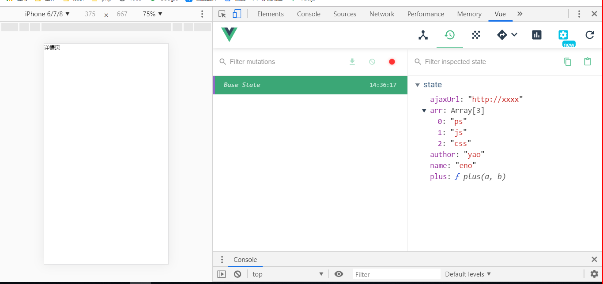
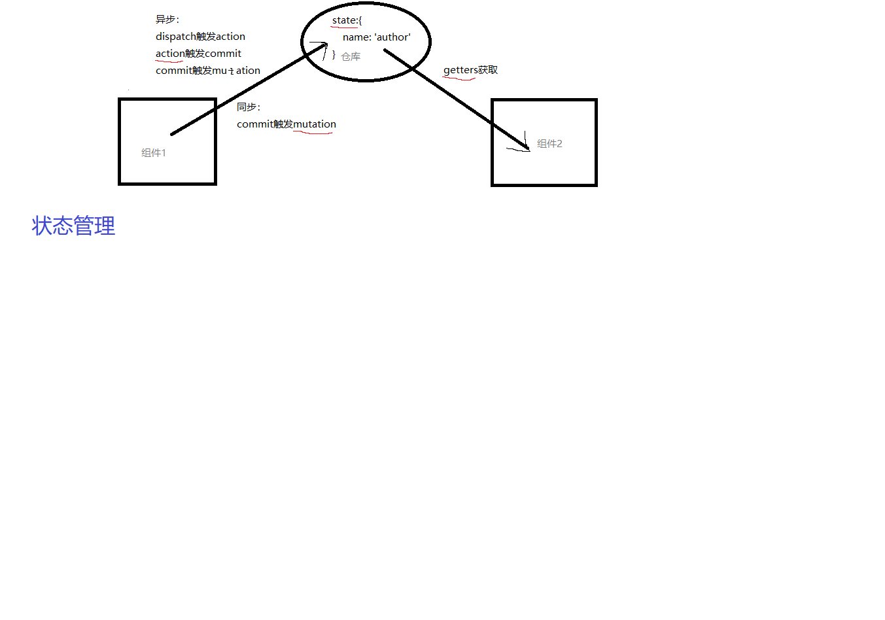

# 路由懒加载

```js
// 同步加载
import Home from './views/Tabbar/Home'
// 懒加载
const Home = () => import('./views/Tabbar/Home')
```

# vuex

五大核心概念

- getters
- mumtations
- actions
- state
- modules

Vuex 是什么？

Vuex 是一个专为 Vue.js 应用程序开发的状态管理模式。

vuex也是完美兼容vue-devtools

flux这所有状态管理的鼻祖，redux是借鉴了flux，vuex又借鉴了redux

小型项目的话，用`Vue.observable`小型状态管理器，跨组件状态存储器
```js
const state = Vue.observable({ count: 0 })
```
大型项目才考虑，vuex


使用 NPM 安装

```bash
npm install vuex --save
```

激活vuex
在一个模块化的打包系统中，您必须显式地通过 Vue.use() 来安装 Vuex：
```bash
import Vue from 'vue'
import Vuex from 'vuex'
Vue.use(Vuex)
```

# 最简单的 Store （面试重点）

初始化一个仓库
```js
import Vuex from 'vuex'
Vue.use(Vuex)
// 初始化一个仓库
const store = new Vuex.Store({})
export default store
```
你可以在state属性值里面存放一些值，你可以存放各种类型的值
```js
const store = new Vuex.Store({
    // 所有的仓库的值都会放在这里面
    // 状态===仓库的值
    state: {
        author: 'yao',
        name: 'eno',
        ajaxUrl: 'http://xxxx',
        arr: ['ps', 'js', 'css'],
        plus(a, b) {
            return a + b
        }
    }
})
```
mutations用于修改state的值，里面可以存放很多修改state的值的方法
```js
mutations: {
    setAuthor(state) {
        state.author = 'jin'
    },
    setName(state, name) {
        state.author = name
    }
}
```
把store注入到容器里面，你整个app就拥有store
```js
// 引入状态管理
import store from './store'
new Vue({
    store
})
```
你可以从调试工具里面这样看到


# 如何获取和修改仓库里面的值

最暴力方法，直接从$store.state.xxx里面获取
```js
export default {
  // 接收路由组建传给我的props
  props: ["default", "sidebar"],
  created() {
    console.log(this.$store.state.author);
  }
};
```

获取的官方指定方法，现在在store里面定义getters，然后封装一个获取state。name的方法，它的好处在于把所有获取值的方法定义好，方便管理，并且可以在取数据的时候对数据处理
```js
// 定义getters方法
getters: {
    getAuthor(state) {
        // 获取数据，去做一次数据处理，等价于一个计算属性或者过滤器
        return state.name + 'abc'
    }
}
```
你现在可以通过`this.$store.getters.getAuthor`获取仓库的值
```js
export default {
  // 接收路由组建传给我的props
  props: ["default", "sidebar"],
  created() {
    console.log(this.$store.getters.getAuthor);
    // console.log(this.$store.state.author);
  }
};
```
你现在可以通过`this.$store.commit("setAuthor", xxx)`修改仓库的值
```js
// 用于修改仓库里面的值
// 用于修改仓库里面的值
mutations: {
    setAuthor(state, name) {
        state.author = name
        // 不需要return，跟getters很像
    },
    setName(state, name) {
        state.author = name
    }
},
```
Action 类似于 mutation，不同在于：
Action 提交的是 mutation，而不是直接变更状态。
Action 可以包含任意异步操作。

其实更改值真正只有mutation是可以改的，action触发mutation，action是mutation的老爸，action发号令让mutation改值

- mutation 用于同步修改，绝不能用于异步
- action 用于异步修改

